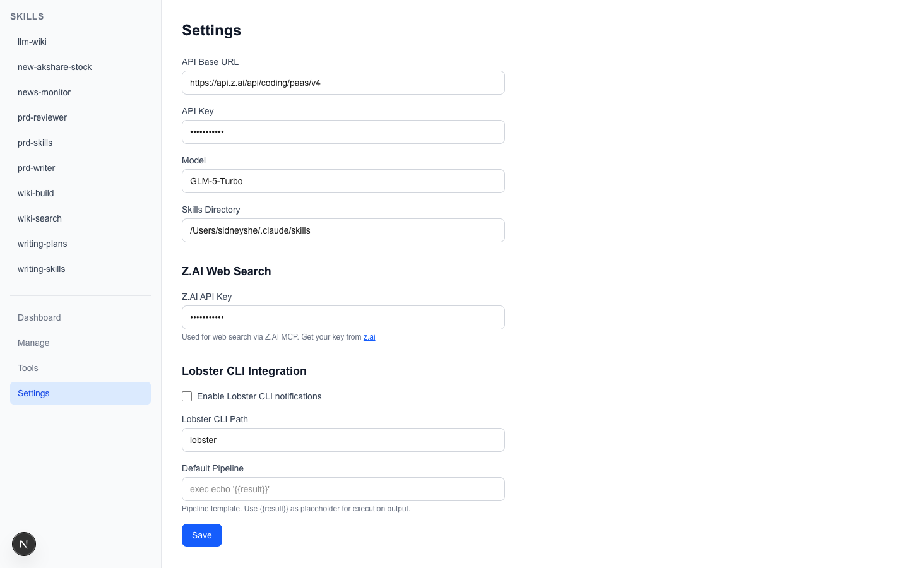

# Skill-Manager — The AI Shift Worker

Skill-Manager is a self-hosted AI automation platform. You set shifts (cron/webhook), equip the toolbox (bash/python/web search/MCP), and configure notifications. Then you clock out — it stays on 24/7.

The core problem of conversational AI is **context pollution** — different tasks bleed into each other. A general-purpose Agent plays every role, can do everything, but masters nothing. Skill-Manager's answer is **context isolation + Skill specialization** — each task runs in an isolated context window; each Skill does one thing and does it reliably. On top of Skills, you describe your needs in natural language, and the LLM auto-configures trigger modes and execution details.

Most work doesn't require deep thinking — it requires focused execution. In *Thinking, Fast and Slow*, Kahneman distinguishes System 1 (automatic, fast, low-effort) from System 2 (deliberate, slow, high-effort). The vast majority of daily tasks — search news, organize data, push reports — are System 1. They don't need reasoning; they need punctuality and focus. So Skill-Manager's design: Skills execute deterministic tasks directly; Agent reasoning is engaged only when genuine deep thinking is required.


**[中文版](README.md)** | **[Whitepaper](docs/whitepaper.md)** | **[Usage Guide](docs/guide.html)**

---

## Features

| Feature | Description |
|---------|-------------|
| **Skill Visualization** | Auto-parse SKILL.md, SHA-256 hash tracking, auto-sync summaries |
| **Multiple Triggers** | Cron (auto-registers to crontab), Webhook, Manual, Chain (up to 5 levels) |
| **Natural Language Task Config** | Describe your needs in natural language on top of existing Skills → LLM auto-parses to structured config |
| **MCP Tool Integration** | Generic MCP client, connect to any MCP service |
| **Execution Tracking** | Full history, reasoning turns, tool call chains, token usage |
| **Lobster Notifications** | Auto-push results to WeChat, DingTalk, Slack, etc. |
| **Self-Hosted** | Supports any OpenAI-compatible API + Ollama, all data stored locally |


---

## Installation & Startup

```bash
# 1. Clone
git clone https://github.com/hongyushe/skill-manager.git
cd skill-manager

# 2. Install dependencies
npm install

# 3. Configure API
cp skill-manager.example.json skill-manager.json
# Edit skill-manager.json with your API key and model

# 4. Start (auto-creates Python venv, builds, runs in background)
./start.sh
# Open http://localhost:10001

# Stop
./stop.sh
```

---

## Configuration

Open `http://localhost:10001/settings` or edit `skill-manager.json`:



### LLM Configuration

| Setting | Description |
|---------|-------------|
| `base_url` | OpenAI-compatible API base URL (Z.AI, OpenRouter, etc.) |
| `api_key` | LLM API Key (auto-masked on display) |
| `model` | Model name (e.g. `glm-4-flash`, `gpt-4o`) |
| `skills_dir` | Skill directory path (default `~/.claude/skills`) |

### Z.AI Web Search

| Setting | Description |
|---------|-------------|
| `zai_api_key` | Z.AI API Key for MCP Web Search tool |

### Lobster CLI Notifications (Optional)

| Setting | Description |
|---------|-------------|
| `lobster_enabled` | Notification toggle (default `false`) |
| `lobster_path` | Path to Lobster CLI binary |
| `lobster_pipeline` | Pipeline template, supports `{{result}}` placeholder |

API Keys are auto-masked on the Settings page (first 4 + `...` + last 4 chars). Placeholder detection preserves original values on save.

---

## Dashboard


- **Active Tasks** — Aggregates all `active` tasks across Skills, shows trigger type icons, task names, parent Skills
- **Skills** — Card grid for Skills with tasks, showing name, task count, and summary
- **Unconfigured** — Lists Skills without configured tasks

On load, Dashboard checks all SKILL.md files via **SHA-256 hash**. If content changed or new Skills found, summaries are auto-regenerated.

---

## Skill Detail Page


### Summary
Three states: No summary → "Generate Summary" button; Has summary → read-only + Edit; Editing → text box + Save/Cancel. Summary is generated by LLM from SKILL.md content, 200-500 chars plain text.

### Tasks
Each task card contains: trigger type icon, name, schedule expression, instruction preview, **Run** and delete buttons.

### Latest Result
- Metadata: timestamp, status, task name, duration
- Collapsible process: `Process (N reasoning turns · M tool calls)`, expand to see each tool call detail
- Final output

### History Timeline
Shows last 10 entries by default, expandable. Each record: time, task name/trigger source, status (color-coded), output summary.

---

## Natural Language Task Configuration

On an existing Skill, click **"+ Add Task"** and describe your needs:


> Search Trump's latest statements every morning at 9am, summarize in Chinese

Click **"Analyze"**, LLM auto-parses to structured config. Edit if needed, then **"Confirm & Save"**.

---

## Trigger Modes

| Type | Description | Configuration |
|------|-------------|---------------|
| **Cron** | Scheduled execution, standard cron expression | `trigger_config: "0 9 * * *"` |
| **Webhook** | HTTP POST callback, external system trigger | Configure endpoint `/api/hooks/my-hook` |
| **Manual** | Click to run from Web UI | Default mode, no config needed |
| **Chain** | Chain trigger, auto-fires next Skill after completion | Configure `chainTarget` |

### Cron Trigger (Auto-Register)
Adding/updating a Cron task **auto-registers to system crontab**:
```
0 9 * * * curl -s -X POST http://localhost:10001/api/execute/news-monitor?trigger=cron&task_id=TASK-001 # skill-manager:news-monitor:TASK-001
```
Deleting a task auto-cleans the corresponding crontab entry.

### Webhook Trigger
```bash
curl -X POST http://localhost:10001/api/hooks/my-hook \
  -H "Content-Type: application/json" \
  -d '{"event": "trigger", "data": "extra context"}'
```

### Chain Trigger
Auto-fires the next Skill after current one completes. Max 5-level chain depth, async fire-and-forget, one Skill failure doesn't affect others.

---

## Tool System & MCP

### Declare Tools in Skill
```markdown
## Tools
- web_search
```

| Tool | Description | Dependency |
|------|-------------|------------|
| `web_search` | Web search via Z.AI MCP | `zai_api_key` |

Tools are auto-invoked by the LLM Agent during execution as needed. Register any external tool dynamically via MCP protocol.

---

## Custom Skill Configuration

Config stored in `~/.claude/skills/skill-manager/<name>/custom.md`:

```markdown
## Tools
- web_search

## Tasks
### TASK-001
- name: Daily News Briefing
- trigger_type: cron
- trigger_config: 0 9 * * *
- instruction: |
    Search today's headlines, compile into briefing...
- status: active
```

### Data Directory Structure
```
~/.claude/skills/
  news-monitor/
    SKILL.md                              # Skill definition (Claude Code reads this)
  skill-manager/
    news-monitor/
      custom.md                           # Custom config (tasks, triggers, tools)
      summary.md                          # LLM-generated summary
      history.json                        # Execution history + edit log
      .skill-hash                         # SHA-256 hash of SKILL.md (change detection)
```

---

## API Reference

### Skill Operations
| Method | Path | Description |
|--------|------|-------------|
| GET | `/api/skills` | List all Skill names |
| GET | `/api/skills/[name]` | Get Skill full details |
| PUT | `/api/skills/[name]` | Update Skill (add/update tasks, summary) |
| DELETE | `/api/skills/[name]` | Delete task or trigger |

### Execution
| Method | Path | Description |
|--------|------|-------------|
| POST | `/api/execute/[name]?trigger=manual&task_id=TASK-001` | Execute a specific task |
| POST | `/api/execute/[name]?trigger=manual` | Execute entire Skill |
| POST | `/api/hooks/[hookId]` | Webhook trigger |

### Other
| Method | Path | Description |
|--------|------|-------------|
| GET/PUT | `/api/settings` | Get/update config (API Key masked) |
| GET/POST | `/api/summary` | Batch sync/generate Skill summaries |
| POST | `/api/interpret` | Natural language to task config |
| POST | `/api/cron` | Manage crontab (register/remove/list) |

---

## Tech Stack

- **Frontend** Next.js App Router + React 19 + Tailwind CSS 4
- **Execution Engine** @mariozechner/pi-coding-agent (multi-turn Agent Loop + Tool Calling)
- **MCP** @modelcontextprotocol/sdk (generic MCP client)
- **Scheduling** System crontab (managed via tagged comments)

### Execution Flow
```
User/Timer/Webhook → API Route (/api/execute/[name])
  → Read Skill config (custom.md)
  → Parse tool declarations (## Tools) → resolveTools() → ToolDefinition[]
  → assemblePrompt() builds full prompt
  → pi-coding-agent Agent Loop
      → LLM decision → tool call → get result → continue reasoning (auto multi-turn)
  → Log execution (history.json)
  → Lobster notification (if enabled)
  → Check Chain trigger → recursively execute next Skill
  → Return result + process data
```

## License

MIT
