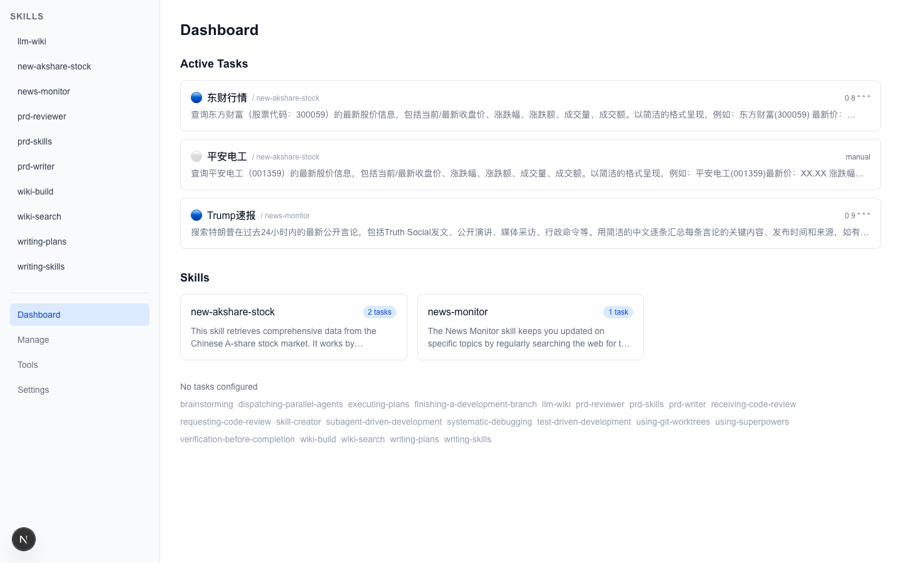
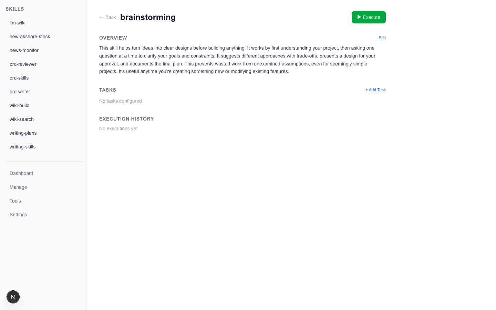
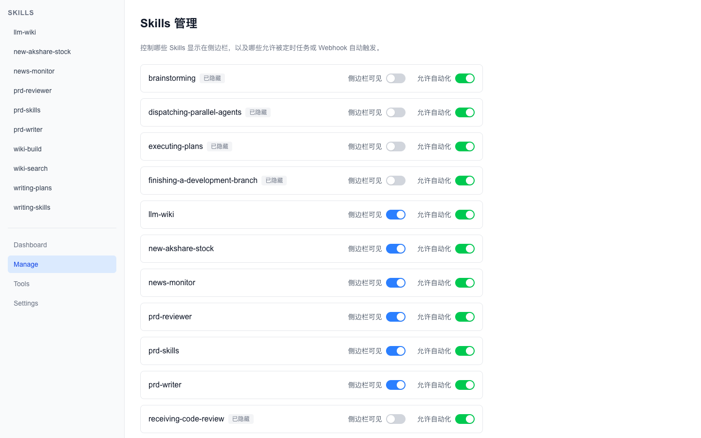
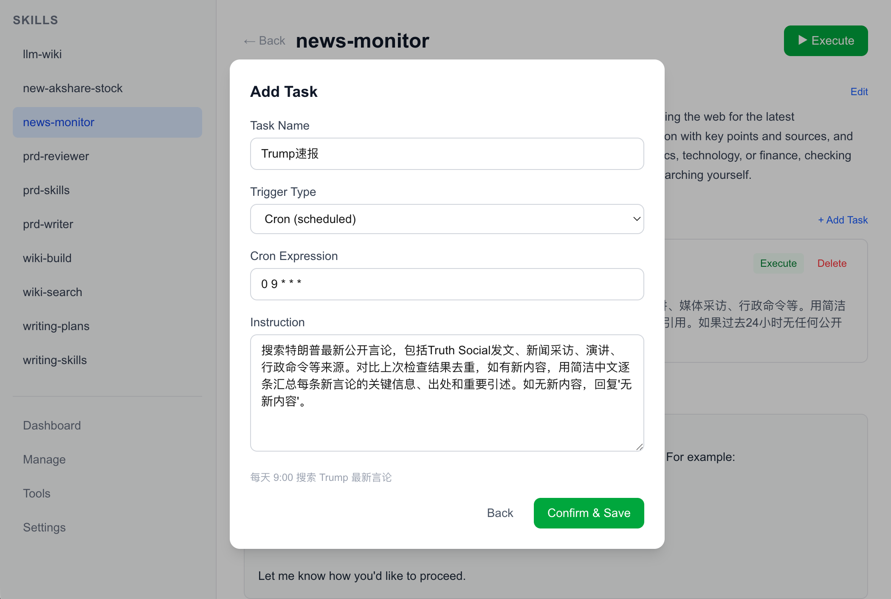
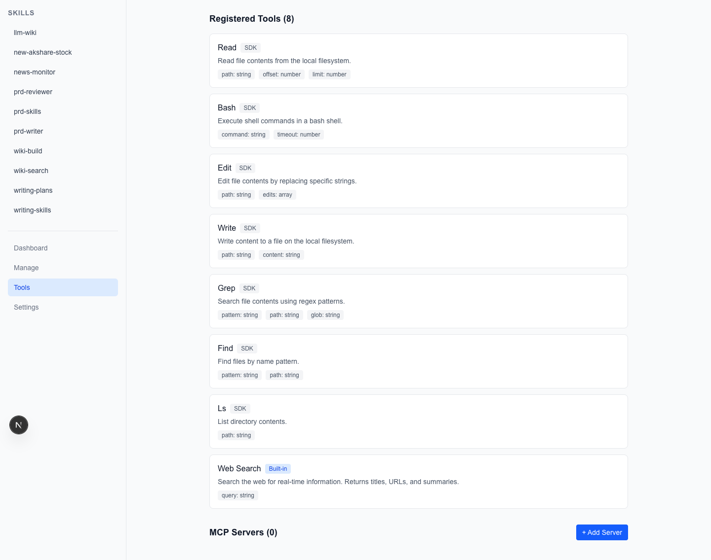

# Skill-Manager — AI 的无人值班室

Skill-Manager 是一个本地部署的 AI 自动化平台。你排好班（cron / webhook），配好工具箱（bash / python / web search / MCP），定好交班方式（推送通知）。然后你下班，它 7x24 值守。

对话式 AI 的核心问题是**上下文污染** — 你让它查了新闻，再让它写代码，两次任务的上下文会串。一个通用 Agent 承担所有角色，什么都能做，但什么都做不精。Skill-Manager 的解法是**上下文隔离 + Skill 专业化** — 每个任务独立上下文窗口，互不干扰；每个 Skill 只做一件事，做到可靠。在 Skill 的基础上，通过自然语言描述需求，LLM 自动配置触发方式和执行细节。

大量工作不需要深度思考，只需要专注执行。Kahneman 在《思考，快与慢》中将认知分为 System 1（自动、快速、低耗能）和 System 2（深思熟虑、慢、高耗能）。日常工作中绝大多数任务是 System 1 —— 搜新闻、整理数据、推送报告 —— 它们不需要推理，需要的是准时和专注。所以 Skill-Manager 的设计是：Skill 直接执行确定性的任务，只在真正需要深度思考时才动用 Agent 推理能力。


**[English Version](README.md)** | **[白皮书 / Whitepaper](docs/whitepaper.md)**

---

## 核心能力

- **Skill 可视化** — 自动解析 SKILL.md，生成结构化摘要（哈希追踪自动同步）
- **多种触发方式** — Cron 定时、Webhook 回调、手动执行、Chain 链式触发
- **自然语言配置任务** — 在已有 Skill 基础上，中文描述 → LLM 自动解析为结构化配置
- **Agent 工具箱** — bash/python3 + 文件操作 + Web Search + MCP 动态扩展
- **工具注册页面** — 管理 SDK 内置工具和 MCP 服务器，自动发现工具
- **Skills 管理页面** — 控制侧边栏可见性和自动化开关
- **执行追踪** — 完整的执行历史、Token 用量、可折叠过程展示
- **Lobster 通知** — 执行结果自动推送到微信、钉钉、Slack 等外部通道
- **本地部署** — 支持任意 OpenAI 兼容 API 和 Ollama 本地模型，数据不出内网

---

## 安装与启动

```bash
git clone https://github.com/hongyushe/skill-manager.git
cd skill-manager
npm install
cp skill-manager.example.json skill-manager.json
# 编辑 skill-manager.json，填入你的 API key 和 model
./start.sh
# 打开 http://localhost:10001
```

停止：`./stop.sh`

---

## 配置

打开 `http://localhost:10001/settings` 或编辑 `skill-manager.json`：

### LLM 配置

| 配置项 | 说明 |
|--------|------|
| `base_url` | OpenAI 兼容 API 的 Base URL（Z.AI、DeepSeek、Ollama 等） |
| `api_key` | LLM API Key（GET 时自动脱敏，显示前4位+...+后4位） |
| `model` | 模型名称（如 `glm-4-flash`、`gpt-4o`、`qwen2.5`） |
| `skills_dir` | Skill 目录路径（默认 `~/.claude/skills`，可通过环境变量 `SKILLS_DIR` 覆盖） |

### Z.AI Web Search

| 配置项 | 说明 |
|--------|------|
| `zai_api_key` | Z.AI API Key，用于内置 Web Search 工具 |

### Lobster CLI 通知（可选）

| 配置项 | 说明 |
|--------|------|
| `lobster_enabled` | 通知开关（默认 `false`） |
| `lobster_path` | Lobster CLI 可执行文件路径 |
| `lobster_pipeline` | Pipeline 模板，支持 `{{result}}` 占位符，执行后自动替换为结果文本 |

通知示例 Pipeline：
```
exec curl -s -X POST 'https://hooks.slack.com/services/YOUR/WEBHOOK' \
  -H 'Content-Type: application/json' \
  -d '{"text":"{{result}}"}'
```

每次 Skill 执行成功后自动触发（异步，不阻塞执行），用于推送结果到微信、钉钉、Slack 等外部通道。

### 安全机制

- API Key 在 Settings 页面显示时自动脱敏（前4位 + `...` + 后4位）
- 保存时检测 `...` 占位符，自动保留原值不被覆盖

### 环境变量

| 变量 | 说明 | 默认值 |
|------|------|--------|
| `SKILLS_DIR` | Skill 目录路径 | `~/.claude/skills` |
| `OPENAI_BASE_URL` | LLM API Base URL（被 config 文件覆盖） | — |
| `OPENAI_API_KEY` | LLM API Key（被 config 文件覆盖） | — |
| `OPENAI_MODEL` | 模型名称（被 config 文件覆盖） | `gpt-4o` |
| `PORT` | 服务端口 | `10001` |

---

## 仪表盘



首页展示所有已注册的 Skills 和活跃任务。

- **Active Tasks** — 汇总所有 Skill 中状态为 `active` 的定时任务，显示触发类型图标（蓝色=Cron、绿色=Webhook、白色=Manual）、任务名称、所属 Skill 和调度表达式
- **Skills** — 有任务的 Skill 卡片网格，显示名称、任务数量和摘要
- **未配置任务** — 列出所有没有配置任务的 Skill

### 自动同步

Dashboard 加载时自动检测所有 SKILL.md 的 SHA-256 哈希。如果 SKILL.md 内容发生变化，或发现新 Skill，自动重新生成摘要。基于哈希对比，避免不必要的 LLM 调用。

---

## Skill 详情页



点击 Skill 名称进入详情页，包含以下区域：

### 摘要（Summary）

三种状态：
- **无摘要** → 显示"Generate Summary"按钮，点击调用 LLM 生成
- **有摘要** → 只读显示 + "Edit"按钮
- **编辑中** → 文本框 + Save/Cancel 按钮

摘要由 LLM 基于 SKILL.md 内容生成，200-500 字纯文本描述。

### 任务（Tasks）

每个任务以卡片形式展示，包含：
- 触发类型图标和名称
- 调度表达式（Cron 类型）
- 指令预览
- **▶ Run** 按钮 — 手动执行该任务
- 删除按钮

### 最新结果（Latest Result）

展示最近一次执行的结果：
- 元信息：时间戳、状态（success/failed）、任务名称、耗时
- **可折叠过程行**：`▸ 过程 (N轮推理 · M次工具调用)`，点击展开显示每次工具调用详情
- 最终输出结果

> 过程数据仅在执行后临时显示，刷新页面后消失，只保留最终结果。过程数据不持久化到 history.json。

### 执行历史（History Timeline）

- 默认显示最近 10 条执行记录，可展开查看全部
- 每条记录：时间、任务名/触发来源、状态（颜色区分）、输出摘要（截断80字）
- 完整的编辑日志（每次 custom.md 的修改都记录 before/after）存储在 history.json 中

---

## 自然语言配置任务



Skill 详情页点击"+ Add Task"打开创建向导：

**第一步：输入描述**
用中文（或英文）描述你想要的任务，例如：
> 每天早上9点搜索特朗普最新言论，用中文汇总

点击"Analyze"，LLM 自动解析为结构化配置。

**第二步：审核并保存**
LLM 返回解析结果，可手动修改：任务名称、触发类型、触发配置、执行指令。点击"Confirm & Save"保存。任务 ID 自动递增（TASK-001, TASK-002, ...）。



---

## 触发方式

| 类型 | 说明 | 配置方式 |
|------|------|----------|
| `cron` | 定时执行，标准 Cron 表达式 | `trigger_config: "0 9 * * *"`（每天9点） |
| `webhook` | 通过 HTTP POST 触发，支持外部系统集成 | 配置 endpoint，如 `/api/hooks/my-hook` |
| `manual` | 手动触发，通过 Web 界面点击 Run | 默认方式，无需额外配置 |
| `chain` | 链式触发，一个 Skill 执行完后自动触发下一个 | 配置 `chainTarget` 指定下一个 Skill 名称 |

### Cron 触发

添加/更新 Cron 类型的 Task 时，系统**自动注册到系统 crontab**，无需手动配置。

```
0 9 * * * curl -s -X POST http://localhost:10001/api/execute/news-monitor?trigger=cron&task_id=TASK-001 # skill-manager:news-monitor:TASK-001
```

- 使用标记注释 `# skill-manager:<name>:<taskId>` 管理条目
- 删除 Task 时自动清理对应的 crontab 条目

### Webhook 触发

```bash
curl -X POST http://localhost:10001/api/hooks/my-hook \
  -H "Content-Type: application/json" \
  -d '{"event": "trigger", "data": "额外上下文信息"}'
```

### Chain 链式触发

当前 Skill 执行完成后，自动触发下一个 Skill。最大 **5 层**链式嵌套深度（防止无限循环），异步 fire-and-forget，链中某个 Skill 失败不影响其他 Skill。

---

## Agent 工具箱



### SDK 内置工具（来自 pi-coding-agent）

| 工具 | 说明 |
|------|------|
| `bash` | 执行 Shell 命令（包括 python3 脚本） |
| `read` | 读取文件内容 |
| `write` | 写入文件 |
| `edit` | 编辑文件（精确字符串替换） |
| `grep` | 搜索文件内容（正则匹配） |
| `find` | 搜索文件名 |
| `ls` | 列出目录内容 |

> Agent 可以通过 `bash` 工具调用 `python3` 运行 Python 脚本，用于数据分析、文件处理等任务。

### 自定义内置工具

| 工具 | 说明 | 参数 | 依赖 |
|------|------|------|------|
| `web_search` | 通过 Z.AI MCP 搜索 Web | `query`: 搜索关键词 | `zai_api_key` |

### MCP 工具（动态注册）

通过 Tools 页面注册 MCP 服务器，动态发现并加载工具。所有注册的工具对所有 Skill 自动可用。工具在执行时由 LLM Agent 自动判断何时调用，无需手动触发。

---

## Tools 管理页面

访问 `/tools`，管理所有可用工具和 MCP 服务器。

### 已注册工具列表

展示三类工具，用不同颜色标签区分：
- **SDK**（灰色）— pi-coding-agent 内置工具（bash、read、write 等），不可删除
- **Built-in**（蓝色）— skill-manager 自定义工具（web_search），不可删除
- **MCP**（紫色）— 通过 MCP 服务器注册的工具，可删除

### MCP 服务器管理

1. 点击 "+ Add Server"
2. 填写 MCP 服务器名称、URL、API Key（可选）
3. 点击 "Discover Tools" — 连接 MCP 服务器，调用 `listTools()` 发现可用工具
4. 点击 "Register All Tools" — 将发现的工具注册到配置中

---

## Skills 管理页面

访问 `/manage`，控制 Skills 的显示和自动化行为。

- **侧边栏可见性** — 关闭后该 Skill 从左侧导航栏隐藏，但仍可正常执行
- **自动化开关** — 关闭后 Cron/Webhook/Chain 触发返回 403，手动执行正常工作

---

## 自定义 Skill 配置

配置存储在 `~/.claude/skills/skill-manager/<name>/custom.md`：

```markdown
## Tasks
### TASK-001
- name: 任务名称
- trigger_type: cron
- trigger_config: 0 9 * * *
- instruction: |
    具体的任务指令...
- status: active
```

### 数据目录结构

```
~/.claude/skills/
  news-monitor/
    SKILL.md                              # Skill 定义（Claude Code 读取此文件）
  skill-manager/
    news-monitor/
      custom.md                           # 自定义配置（任务、触发器、工具）
      summary.md                          # LLM 自动生成的摘要
      history.json                        # 执行历史 + 编辑日志
      .skill-hash                         # SKILL.md 的 SHA-256 哈希（用于变更检测）
```

> `skill-manager/` 子目录确保数据文件不干扰 Claude Code 对 SKILL.md 的读取。

---

## API 参考

### Skill 操作

| 方法 | 路径 | 说明 |
|------|------|------|
| GET | `/api/skills` | 列出所有 Skill 名称 |
| GET | `/api/skills/[name]` | 获取 Skill 完整详情 |
| PUT | `/api/skills/[name]` | 更新 Skill（添加/更新任务、摘要等） |
| DELETE | `/api/skills/[name]` | 删除任务或触发器 |
| GET | `/api/skills/visibility` | 获取所有 Skill 的可见性配置 |
| PUT | `/api/skills/visibility` | 更新单个 Skill 的可见性/自动化开关 |

### 执行

| 方法 | 路径 | 说明 |
|------|------|------|
| POST | `/api/execute/[name]?trigger=manual&task_id=TASK-001` | 执行指定任务 |
| POST | `/api/execute/[name]?trigger=manual` | 执行整个 Skill |
| POST | `/api/hooks/[hookId]` | Webhook 触发 |

### 工具管理

| 方法 | 路径 | 说明 |
|------|------|------|
| GET | `/api/tools` | 列出所有工具（SDK + Built-in + MCP） |
| POST | `/api/tools` | 注册新工具 |
| DELETE | `/api/tools?name=xxx` | 删除指定工具 |
| POST | `/api/mcp` | 连接 MCP 服务器并发现工具 |

### 其他

| 方法 | 路径 | 说明 |
|------|------|------|
| GET | `/api/settings` | 获取配置（API Key 脱敏） |
| PUT | `/api/settings` | 更新配置 |
| GET | `/api/summary` | 批量同步所有 Skill 摘要 |
| POST | `/api/summary` | 生成单个 Skill 摘要 |
| POST | `/api/interpret` | 自然语言解析为任务配置 |
| POST | `/api/cron` | 管理系统 Crontab（register/remove/list） |

---

## 技术架构

- **前端**: Next.js App Router + React 19 + Tailwind CSS 4
- **执行引擎**: @mariozechner/pi-coding-agent（多轮 Agent Loop + Tool Calling）
- **MCP**: @modelcontextprotocol/sdk（通用 MCP 客户端）
- **调度**: 系统 crontab（标记注释管理）

### 执行流程

```
用户/定时器/Webhook → API Route (/api/execute/[name])
  → 检查自动化开关（非 manual 触发时检查 automation_enabled）
  → 读取 Skill 配置 (custom.md)
  → resolveAllTools() 合并 SDK 工具 + 自定义工具 + MCP 工具
  → assemblePrompt() 组装完整 Prompt
  → pi-coding-agent Agent Loop
      → LLM 决策 → 调用工具 → 获取结果 → 继续推理
      → 直到输出最终结果（多轮自动）
  → 记录执行日志 (history.json)
  → Lobster 通知（如已启用）
  → 检查 Chain 触发 → 递归执行下一个 Skill
  → 返回结果 + 过程数据
```

## License

MIT
